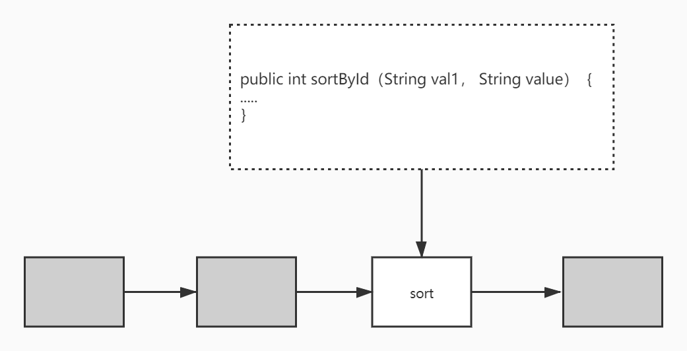
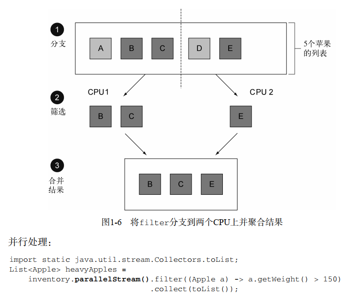
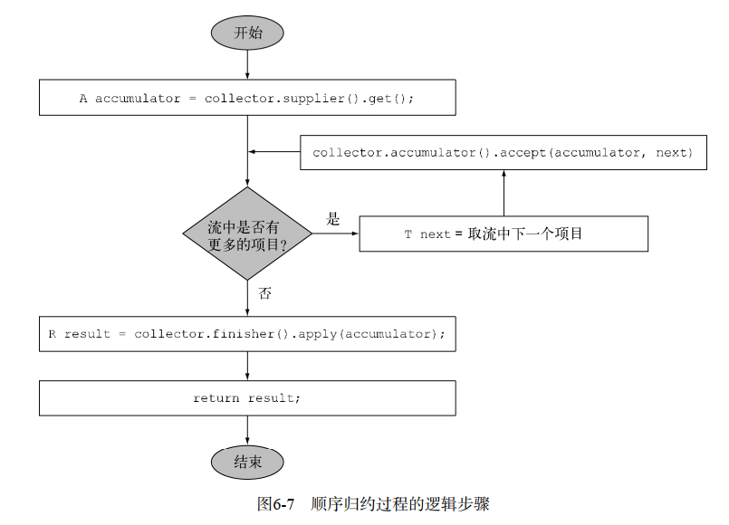
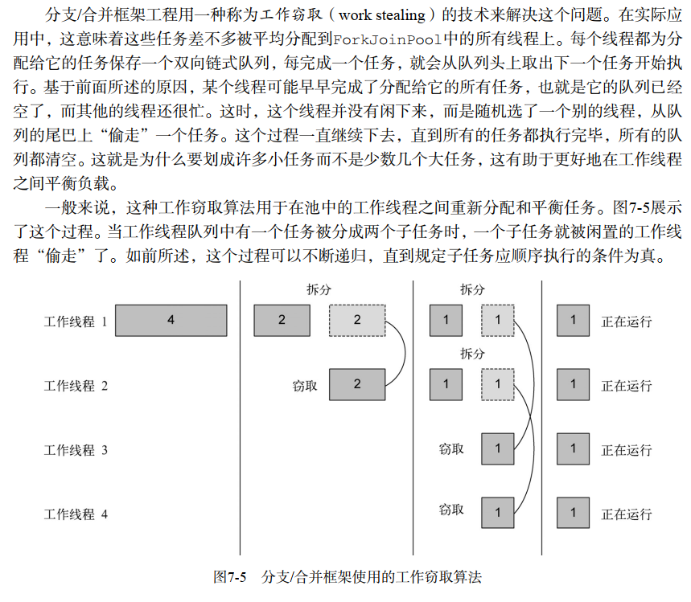
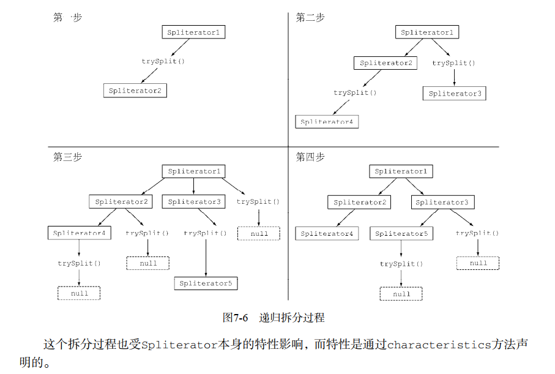
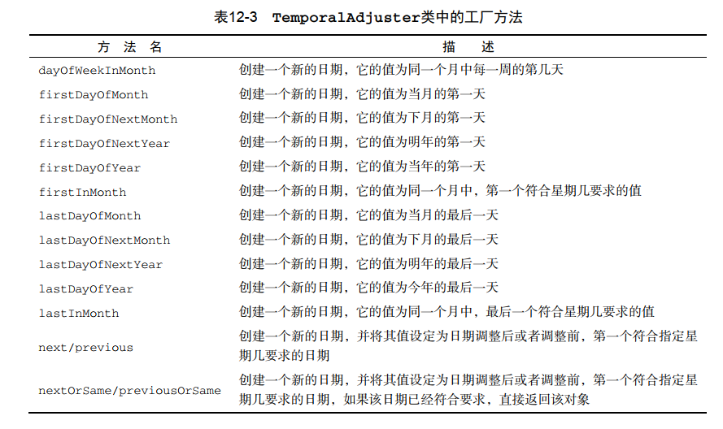
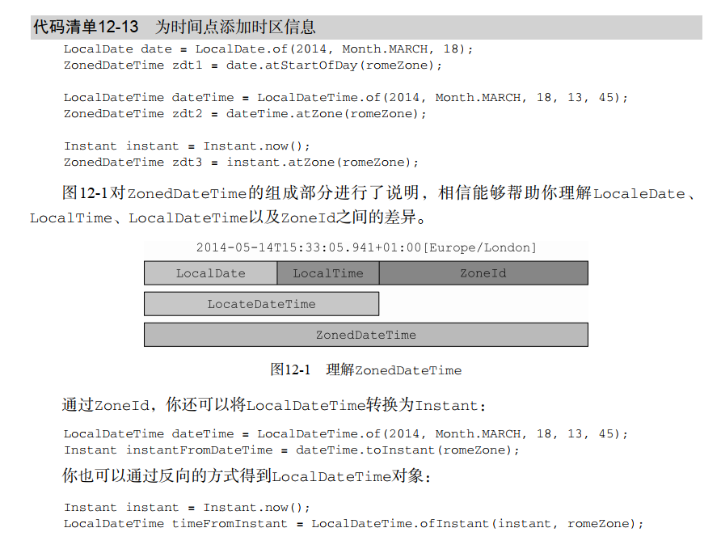

# 1.基础知识

## 1.1 流处理

流是一系列数据项，一次只生成一项。可以想象成汽车组装流水线，尽管流水线实际上是一个序列，但不同加工站的运行一般是并行的。

```shell
# 该例子表示把两个文件连接起来创建一个流，然后转换流中的字符，对流中的行进行排序，最后给出流的最后三行。
# 这几个命令在Unix中是同时执行的。
cat file1 file2 | tr "[a-z]" "[A-Z]" | sort | tail -3
```


## 1.2行为参数化

Stream API是构建在通过传递代码使得操作行为实现参数化的思想上。

比方说，你有一堆发票代码，格式类似于2013UK0001、2014US0002……前四位数代表年份， 接下来两个字母代表国家，最后四位是客户的代码。你可能想按照年份、客户代码，甚至国家来 对发票进行排序。你真正想要的是，能够给sort命令一个参数让用户定义顺序：给sort命令传 递一段独立代码。**Java8增加了把代码作为参数传递给另一个方法的能力**。



## 1.3 并行与共享的可变数据

> 没有共享的可变数据和将方法和函数即代码传递给其他方法的能力是函数式编程范式的基石。函数式编程中的函数的主要意思是“把函数作为一等值”，也即“执行时在元素之间无互动”。

## 1.4 函数

- Java8允许把方法和函数作为一等公民（可传递的值）。让方法作为值构成了其他若干Java8功能的基础。
- Java8可以传递方法引用，以前只能传递对象引用
- 谓词（predicate）：在数学上常常用来代表一个类似函数的东西，他接受一个参数值，并返回true或false。
- **如果Lambda的长度多于几行，它的行为也不是一目了然的话，应该用方法引用来指向一个有描述性名称的方法，而不是使用匿名的Lambda。**

## 1.5 Stream API与Collection API

- 用集合循环一个个去迭代再处理元素称为**外部迭代**，流处理是在库内部进行的，称为**内部迭代**。
- 流的并行比使用线程同步更不易出错，流天生具有利用多核的优势。
- **Collection主要是为了存储和访问数据，而Stream则主要用于描述对数据的计算**。



## 1.6 默认方法

设计默认方法的目的在于改变已发布的接口而不破坏已有的实现。例如Java8中List新增的默认方法：

```java
default void sort(Comparator<? super E> c) {
    Object[] a = this.toArray();
        Arrays.sort(a, (Comparator) c);
        ListIterator<E> i = this.listIterator();
        for (Object e : a) {
            i.next();
            i.set((E) e);
        }
}
```

*但一个类可以实现多个接口，如果在好几个接口里有多个默认实现，某种程度上意味着Java有了多重继承。Java用一些限制来避免出现类似C++中的菱形继承问题。*


# 2.Lambda表达式

可以把Lambda表达式看做匿名函数，也就是没有声明名称的方法，和匿名类一样可以作为参数传递给一个方法，它有参数列表、函数主体、返回类型、还有可能有可以抛出的异常列表。

```java
// 表达式就是Lambda的返回值
(parameters) -> expression
(parameters) -> { statements;}
(1).() -> {}
(2).() -> "hello world"
(3).() -> { return "hello world";}
(4).(Integer i) -> return "hello" + i; //无效，不应有return
(5).(String s) -> { "IronMan"; } //无效，显示返回要加上return

```

## 2.1 函数式接口

**函数式接口中的抽象方法的签名可以描述Lambda表达式的签名。函数式接口的抽象方法的签名成为函数描述符。**

> 任何函数式接口都不允许抛出受检异常。

## 2.2 类型检查、推断和限制

Lambda的类型是从使用Lambda的上下文推断出来的。**如果Lambda表达式抛出一个异常，那么抽象方法所声明的throws语句也必须与之匹配**

> **特殊的void兼容规则：**如果一个Lambda的主体是一个语句表达式， 它就和一个返回void的函数描述符兼容。

### 2.2.1 使用局部变量

Lambda表达式允许使用自由变量（在外层作用域中定义的变量），就像匿名类一样，它们被称作Lambda捕获。**Lambda可以没有限制地捕获实例变量和静态变量，但局部变量必须显式声明为final或逻辑上是final的，也就是只能捕获局部变量一次**

> **闭包**
>
> 闭包是一个函数的实例，且它可以无限制地访问那个函数的非本地变量。但Lambda访问非本地变量有必须是隐式最终的限制，因为局部变量保存在栈上，是线程私有的，线程访问非本地局部变量时实际上是访问它的副本。可以认为Lambda对值封闭，而不是对变量封闭。

### 2.2.2 方法引用

如果一个Lambda代表的只是“直接调用这个方法”，那最好还是用名称来调用它，而不是去描述如何调用它。  可以把方法引用看作针对仅仅涉及单一方法的Lambda的语法糖

- 指向静态方法的方法引用。`Integer::parseInt`
- 指向任意类型实例方法的方法引用。`String::length`
- 指向现有对象的实例方法的方法引用。在 Lambda 中 调 用 一 个 已 经 存 在 的 外 部 对 象 中 的 方 法 。 例 如 ， Lambda 表 达 式
  `()->expensiveTransaction.getValue()`可以写作`expensiveTransaction::getValue`

###  2.2.3 复合

```java
// 1.比较器链。如先按重量递减排序，两个苹果一样重时，再按国家排序
inventory.sort(comparing(Apple::getWeoght))
    .reversed()
    .thenComparing(Apple::getCountry)
// 2.谓词复合。and和or是按照在表达式链中的位置从左向右确定优先级的。a.or(b).and(c)可以看做(a || b) && c
Predicate<Apple> redAndHeavyAppleOrGreen = redApple.and(a -> a.getWeight() > 150)
											.or(a -> "green".equals(a.getColor()));
// 3.函数复合。
Function<Integer, Integer> f = x -> x + 1;
Function<Integer, Integer> g = x -> x * 2;
Function<Integer, Integer> h = f.andThen(g); //数学上写作g(f(x))
Function<Integer, Integer> h = f.compose(g); //数学上写作f(g(x))
int result = h.apply(1);
```

# 3.引入流

流：从支持数据处理操作的源生成的元素序列。**流只能消费一次且是按需计算的。**

- 元素序列：访问特定元素类型的一组有序值 ，集合讲的是数据，流讲的是计算 。
- 源：从有序集合生成流时会保留原有的顺序。由列表生成的流，其元素顺序与列表一致。  
- 数据处理操作：流操作可以顺序执行，也可并行执行 。
- 流水线：很多流操作本身会返回一个流 ，流水线的操作可以看作对数据源进行数据库式查询。  
- 内部迭代：流的迭代操作是在背后进行的。 **Streams库的内部迭代可以自动选择一种适合你硬件的数据表示和并行实现。**  

## 3.1 流操作

可以连接起来的流操作称为中间操作，关闭流的操作称为操作。  **流的流水线理念类似于建造者模式。**

### 3.1.1 中间操作

中间操作会返回另一个流。除非流水线上触发一个终端操作，否则中间操作不会执行任何处理，因为中间操作一般都可以合并起来，在终端操作时一次性全部处理。  

### 3.1.2 终端操作

终端操作会从流的流水线生成结果。其结果是任何不是流的值，比如List、 Integer，甚至void。  

# 4.使用流

## 4.1 筛选和切片

filter

## 4.2 映射

map、flatMap

## 4.3 查找和匹配

allMatch、anyMatch、noneMatch、findFirst、findAny

## 4.4 归约

reduce

> **归约方法的优势与并行化**
>
> 相比于逐步迭代，使用reduce的好处在于，这里的迭代被内部迭代抽象化了，这让内部实现得以选择并行执行reduce操作。而迭代式求和例子要更新共享变量sum，这不是那么容易并行化的。如果你加入了同步，很可能会发现线程竞争消了并行本应带来的
> 性能提升。这种计算的并行化需要另一种办法法：将输入分块，分块求和，最后合并起来。但这样的代码看起来就完全不一样了。但要并行执行需要代价，传递给reduce的Lambda不能更改状态（如实例变量），而且操作必须满足结合律才可以按任意顺序执行。  

## 4.5 原始类型流特化

为了避免拆装箱操作带来的性能损耗，Java8引入了三个原始类型特化流接口（Optional也有）来解决这个问题：IntStream、DoubleStream和LongStream。

## 4.6 创建流

```java
//由值创建流
Stream<String> stream = Stream.of("Java 8 ", "Lambdas ", "In ", "Action");
Stream<String> emptyStream = Stream.empty();
//由数组创建流
int[] numbers = {2, 3, 5, 7, 11, 13};
int sum = Arrays.stream(numbers).sum();
//由函数生成流
Stream.iterate(new int[]{0, 1},t -> new int[]{t[1],t[0] + t[1]})
.limit(10)
.map(t -> t[0])
.forEach(System.out::println);
// ===相比于iterate，generate是有状态的
IntSupplier fib = new IntSupplier(){
private int previous = 0;
private int current = 1;
public int getAsInt(){
int oldPrevious = this.previous;
int nextValue = this.previous + this.current;
this.previous = this.current;
this.current = nextValue;
return oldPrevious;
}
};
IntStream.generate(fib).limit(10).forEach(System.out::println);
//=====
```

# 5.用流收集数据

## 5.1 Collectors预定义收集器

- `Collectors.counting`计数
- `Collectors.max(min)By` 查找最大值和最小值
- `Collectors.summingInt`，`Collectors.averagingInt(Long|Double)`汇总
- `Collectors.summarizingInt(Long|Double)`一次性取总和、平均值、最大值和最小值
- `Collectors.joining(可选分隔符)`连接字符串

## 5.2 广义的归约汇总

`Collectors.reducing`：把流中的第一个项目作为起点，把恒等函数（即一个函数仅仅是返回其输入参数）作为一个转换函数。注意可能会返回`null`。

> **收集与归约**
>
> reduce方法旨在把两个值结合起来生成一个新值，是一个不可变的归约。collect是改变容器从而累积要输出的结果。

## 5.3 分组

- 一级分组。`groupingBy(f)`，f是分类函数实际上是`groupingBy(f, toList())`的简便写法
- n级分组，可以将collector类型传递给前一个`groupingBy`的第二个参数，以此类推。
- 按子组收集数据，`groupingBy`的第二个收集器可以是任何类型
- 把收集器的结果转换为另一种类型。`Collectors.collectingAndThen`
- `mapping`

## 5.4 分区

`partitioningBy`分区是分组的特殊情况，由一个谓词作为分类函数，他称为分区函数。

## 5.5 收集器接口

```java
package java.util.stream;

import java.util.Collections;
import java.util.EnumSet;
import java.util.Objects;
import java.util.Set;
import java.util.function.BiConsumer;
import java.util.function.BinaryOperator;
import java.util.function.Function;
import java.util.function.Supplier;

// A compilation test for the code snippets in this class-level javadoc can be found at:
// test/jdk/java/util/stream/test/org/openjdk/tests/java/util/stream/CollectorExample.java
// The test needs to be updated if the examples in this javadoc change or new examples are added.

/**
 * A <a href="package-summary.html#Reduction">mutable reduction operation</a> that
 * accumulates input elements into a mutable result container, optionally transforming
 * the accumulated result into a final representation after all input elements
 * have been processed.  Reduction operations can be performed either sequentially
 * or in parallel.
 *
 * <p>Examples of mutable reduction operations include:
 * accumulating elements into a {@code Collection}; concatenating
 * strings using a {@code StringBuilder}; computing summary information about
 * elements such as sum, min, max, or average; computing "pivot table" summaries
 * such as "maximum valued transaction by seller", etc.  The class {@link Collectors}
 * provides implementations of many common mutable reductions.
 *
 * <p>A {@code Collector} is specified by four functions that work together to
 * accumulate entries into a mutable result container, and optionally perform
 * a final transform on the result.  They are: <ul>
 *     <li>creation of a new result container ({@link #supplier()})</li>
 *     <li>incorporating a new data element into a result container ({@link #accumulator()})</li>
 *     <li>combining two result containers into one ({@link #combiner()})</li>
 *     <li>performing an optional final transform on the container ({@link #finisher()})</li>
 * </ul>
 *
 * <p>Collectors also have a set of characteristics, such as
 * {@link Characteristics#CONCURRENT}, that provide hints that can be used by a
 * reduction implementation to provide better performance.
 *
 * <p>A sequential implementation of a reduction using a collector would
 * create a single result container using the supplier function, and invoke the
 * accumulator function once for each input element.  A parallel implementation
 * would partition the input, create a result container for each partition,
 * accumulate the contents of each partition into a subresult for that partition,
 * and then use the combiner function to merge the subresults into a combined
 * result.
 *
 * <p>To ensure that sequential and parallel executions produce equivalent
 * results, the collector functions must satisfy an <em>identity</em> and an
 * <a href="package-summary.html#Associativity">associativity</a> constraints.
 *
 * <p>The identity constraint says that for any partially accumulated result,
 * combining it with an empty result container must produce an equivalent
 * result.  That is, for a partially accumulated result {@code a} that is the
 * result of any series of accumulator and combiner invocations, {@code a} must
 * be equivalent to {@code combiner.apply(a, supplier.get())}.
 *
 * <p>The associativity constraint says that splitting the computation must
 * produce an equivalent result.  That is, for any input elements {@code t1}
 * and {@code t2}, the results {@code r1} and {@code r2} in the computation
 * below must be equivalent:
 * <pre>{@code
 *     A a1 = supplier.get();
 *     accumulator.accept(a1, t1);
 *     accumulator.accept(a1, t2);
 *     R r1 = finisher.apply(a1);  // result without splitting
 *
 *     A a2 = supplier.get();
 *     accumulator.accept(a2, t1);
 *     A a3 = supplier.get();
 *     accumulator.accept(a3, t2);
 *     R r2 = finisher.apply(combiner.apply(a2, a3));  // result with splitting
 * } </pre>
 *
 * <p>For collectors that do not have the {@code UNORDERED} characteristic,
 * two accumulated results {@code a1} and {@code a2} are equivalent if
 * {@code finisher.apply(a1).equals(finisher.apply(a2))}.  For unordered
 * collectors, equivalence is relaxed to allow for non-equality related to
 * differences in order.  (For example, an unordered collector that accumulated
 * elements to a {@code List} would consider two lists equivalent if they
 * contained the same elements, ignoring order.)
 *
 * <p>Libraries that implement reduction based on {@code Collector}, such as
 * {@link Stream#collect(Collector)}, must adhere to the following constraints:
 * <ul>
 *     <li>The first argument passed to the accumulator function, both
 *     arguments passed to the combiner function, and the argument passed to the
 *     finisher function must be the result of a previous invocation of the
 *     result supplier, accumulator, or combiner functions.</li>
 *     <li>The implementation should not do anything with the result of any of
 *     the result supplier, accumulator, or combiner functions other than to
 *     pass them again to the accumulator, combiner, or finisher functions,
 *     or return them to the caller of the reduction operation.</li>
 *     <li>If a result is passed to the combiner or finisher
 *     function, and the same object is not returned from that function, it is
 *     never used again.</li>
 *     <li>Once a result is passed to the combiner or finisher function, it
 *     is never passed to the accumulator function again.</li>
 *     <li>For non-concurrent collectors, any result returned from the result
 *     supplier, accumulator, or combiner functions must be serially
 *     thread-confined.  This enables collection to occur in parallel without
 *     the {@code Collector} needing to implement any additional synchronization.
 *     The reduction implementation must manage that the input is properly
 *     partitioned, that partitions are processed in isolation, and combining
 *     happens only after accumulation is complete.</li>
 *     <li>For concurrent collectors, an implementation is free to (but not
 *     required to) implement reduction concurrently.  A concurrent reduction
 *     is one where the accumulator function is called concurrently from
 *     multiple threads, using the same concurrently-modifiable result container,
 *     rather than keeping the result isolated during accumulation.
 *     A concurrent reduction should only be applied if the collector has the
 *     {@link Characteristics#UNORDERED} characteristics or if the
 *     originating data is unordered.</li>
 * </ul>
 *
 * <p>In addition to the predefined implementations in {@link Collectors}, the
 * static factory methods {@link #of(Supplier, BiConsumer, BinaryOperator, Characteristics...)}
 * can be used to construct collectors.  For example, you could create a collector
 * that accumulates widgets into a {@code TreeSet} with:
 *
 * <pre>{@code
 *     Collector<Widget, ?, TreeSet<Widget>> intoSet =
 *         Collector.of(TreeSet::new, TreeSet::add,
 *                      (left, right) -> { left.addAll(right); return left; });
 * }</pre>
 *
 * (This behavior is also implemented by the predefined collector
 * {@link Collectors#toCollection(Supplier)}).
 *
 * @apiNote
 * Performing a reduction operation with a {@code Collector} should produce a
 * result equivalent to:
 * <pre>{@code
 *     A container = collector.supplier().get();
 *     for (T t : data)
 *         collector.accumulator().accept(container, t);
 *     return collector.finisher().apply(container);
 * }</pre>
 *
 * <p>However, the library is free to partition the input, perform the reduction
 * on the partitions, and then use the combiner function to combine the partial
 * results to achieve a parallel reduction.  (Depending on the specific reduction
 * operation, this may perform better or worse, depending on the relative cost
 * of the accumulator and combiner functions.)
 *
 * <p>Collectors are designed to be <em>composed</em>; many of the methods
 * in {@link Collectors} are functions that take a collector and produce
 * a new collector.  For example, given the following collector that computes
 * the sum of the salaries of a stream of employees:
 *
 * <pre>{@code
 *     Collector<Employee, ?, Integer> summingSalaries
 *         = Collectors.summingInt(Employee::getSalary))
 * }</pre>
 *
 * If we wanted to create a collector to tabulate the sum of salaries by
 * department, we could reuse the "sum of salaries" logic using
 * {@link Collectors#groupingBy(Function, Collector)}:
 *
 * <pre>{@code
 *     Collector<Employee, ?, Map<Department, Integer>> summingSalariesByDept
 *         = Collectors.groupingBy(Employee::getDepartment, summingSalaries);
 * }</pre>
 *
 * @see Stream#collect(Collector)
 * @see Collectors
 *
 * @param <T> the type of input elements to the reduction operation
 * @param <A> the mutable accumulation type of the reduction operation (often
 *            hidden as an implementation detail)
 * @param <R> the result type of the reduction operation
 * @since 1.8
 */
public interface Collector<T, A, R> {
    /**
     * 创建并返回新的可变结果容器的函数。
     * 返回值：返回新的可变结果容器的函数
     */
    Supplier<A> supplier();

    /**
     * A function that folds a value into a mutable result container.
     *
     * @return a function which folds a value into a mutable result container
     */
    BiConsumer<A, T> accumulator();

    /**
     * A function that accepts two partial results and merges them.  The
     * combiner function may fold state from one argument into the other and
     * return that, or may return a new result container.
     *
     * @return a function which combines two partial results into a combined
     * result
     */
    BinaryOperator<A> combiner();

    /**
     * Perform the final transformation from the intermediate accumulation type
     * {@code A} to the final result type {@code R}.
     *
     * <p>If the characteristic {@code IDENTITY_FINISH} is
     * set, this function may be presumed to be an identity transform with an
     * unchecked cast from {@code A} to {@code R}.
     *
     * @return a function which transforms the intermediate result to the final
     * result
     */
    Function<A, R> finisher();

    /**
     * Returns a {@code Set} of {@code Collector.Characteristics} indicating
     * the characteristics of this Collector.  This set should be immutable.
     *
     * @return an immutable set of collector characteristics
     */
    Set<Characteristics> characteristics();

    /**
     * Returns a new {@code Collector} described by the given {@code supplier},
     * {@code accumulator}, and {@code combiner} functions.  The resulting
     * {@code Collector} has the {@code Collector.Characteristics.IDENTITY_FINISH}
     * characteristic.
     *
     * @param supplier The supplier function for the new collector
     * @param accumulator The accumulator function for the new collector
     * @param combiner The combiner function for the new collector
     * @param characteristics The collector characteristics for the new
     *                        collector
     * @param <T> The type of input elements for the new collector
     * @param <R> The type of intermediate accumulation result, and final result,
     *           for the new collector
     * @throws NullPointerException if any argument is null
     * @return the new {@code Collector}
     */
    public static<T, R> Collector<T, R, R> of(Supplier<R> supplier,
                                              BiConsumer<R, T> accumulator,
                                              BinaryOperator<R> combiner,
                                              Characteristics... characteristics) {
        Objects.requireNonNull(supplier);
        Objects.requireNonNull(accumulator);
        Objects.requireNonNull(combiner);
        Objects.requireNonNull(characteristics);
        Set<Characteristics> cs = (characteristics.length == 0)
                                  ? Collectors.CH_ID
                                  : Collections.unmodifiableSet(EnumSet.of(Collector.Characteristics.IDENTITY_FINISH,
                                                                           characteristics));
        return new Collectors.CollectorImpl<>(supplier, accumulator, combiner, cs);
    }

    /**
     * Returns a new {@code Collector} described by the given {@code supplier},
     * {@code accumulator}, {@code combiner}, and {@code finisher} functions.
     *
     * @param supplier The supplier function for the new collector
     * @param accumulator The accumulator function for the new collector
     * @param combiner The combiner function for the new collector
     * @param finisher The finisher function for the new collector
     * @param characteristics The collector characteristics for the new
     *                        collector
     * @param <T> The type of input elements for the new collector
     * @param <A> The intermediate accumulation type of the new collector
     * @param <R> The final result type of the new collector
     * @throws NullPointerException if any argument is null
     * @return the new {@code Collector}
     */
    public static<T, A, R> Collector<T, A, R> of(Supplier<A> supplier,
                                                 BiConsumer<A, T> accumulator,
                                                 BinaryOperator<A> combiner,
                                                 Function<A, R> finisher,
                                                 Characteristics... characteristics) {
        Objects.requireNonNull(supplier);
        Objects.requireNonNull(accumulator);
        Objects.requireNonNull(combiner);
        Objects.requireNonNull(finisher);
        Objects.requireNonNull(characteristics);
        Set<Characteristics> cs = Collectors.CH_NOID;
        if (characteristics.length > 0) {
            cs = EnumSet.noneOf(Characteristics.class);
            Collections.addAll(cs, characteristics);
            cs = Collections.unmodifiableSet(cs);
        }
        return new Collectors.CollectorImpl<>(supplier, accumulator, combiner, finisher, cs);
    }

    /**
     * Characteristics indicating properties of a {@code Collector}, which can
     * be used to optimize reduction implementations.
     */
    enum Characteristics {
        /**
         * Indicates that this collector is <em>concurrent</em>, meaning that
         * the result container can support the accumulator function being
         * called concurrently with the same result container from multiple
         * threads.
         *
         * <p>If a {@code CONCURRENT} collector is not also {@code UNORDERED},
         * then it should only be evaluated concurrently if applied to an
         * unordered data source.
         */
        CONCURRENT,

        /**
         * Indicates that the collection operation does not commit to preserving
         * the encounter order of input elements.  (This might be true if the
         * result container has no intrinsic order, such as a {@link Set}.)
         */
        UNORDERED,

        /**
         * Indicates that the finisher function is the identity function and
         * can be elided.  If set, it must be the case that an unchecked cast
         * from A to R will succeed.
         */
        IDENTITY_FINISH
    }
}

```

- T是流中要收集的项目的泛型
- A是累加器的类型，累加器是在收集过程中用于累积部分结果的对象
- R是收集操作得到的对象的类型
- `characteristics`方法提供了一系列特征，告诉collect方法在执行归约操作的时候可以应用哪些优化，如并行化。

### 5.5.1 supplier建立新的结果容器

该方法返回一个结果为空的supplier，也就是一个无参函数，在调用是它会创建一个空的累加器实例，供数据收集过程使用，所以，在对空流执行操作的时候，这个空的累加器也代表了收集过程的结果。

### 5.5.2 accumulator将元素添加到结果容器

该方法返回执行归约操作的函数。该函数返回void，因为累加器是原位更新，即函数的执行改变了它的内部状态以体现便利元素的效果。

### 5.5.3 finisher对结果容器应用最终转换

该方法必须返回在累积过程的最后要调用的一个函数，以便将累加器对象转换为整个集合操作的最终结果。如果结果无需转换，则只需返回`identity`函数



### 5.5.4 combiner合并两个结果容器

该方法返回一个供归约操作使用的函数，它定义了对流的各个子部分**进行并行处理时**，各个子部分归约所得的累加器要如何合并。对于`toList`而言：只是简单的把从流的第二个部分收集到的项目列表添加到遍历第一部分时得到的列表后面

```java
public static <T> Collector<T, ?, List<T>> toList() {
     return new CollectorImpl<>((Supplier<List<T>>) ArrayList::new, List::add,
                                   (left, right) -> { left.addAll(right); return left; },CH_ID);
}
```

该方法会用到Java7中引入的分支/合并框架和`Spliterator`抽象。

### 5.5.5 characteristics方法

该方法可以提示流是否可以进行归约以及可使用的优化。

- `UNORDERED`--归约结果不受流中项目的遍历和累积顺序的影响

- `CONCUNRRENT`--accumulator函数可以从多个线程同时调用，且收集器可以并行归约流，如果收集器没有标为UNORDERED，它仅在用于无序数据源时才可以进行归约
- `IDENTITY_FINISH`--这表明完成器方法返回的函数是一个恒等函数，可以跳过。

### 5.5.6 自定义收集

对于IDENTITY_FINISH的收集操作，Stream有一个重载的collect方法接受三个函数（supplier,accumulator,combiner）。我们也可以通过实现collector接口定义自己的收集器。

# 6.并行数据处理与性能

Stream的并行流内部使用流Fork/Join框架。

## 6.1 将顺序流转换为并行流

`parallel`会将顺序流转化为并行流。但这不代表流本身发生了变化，只是在内部设置流一个`boolean`标志，表示在调用该方法后的所有操作都并行执行。同样的，可以用`sequential`方法把流变为顺序流，**但是如果将这个两个方法结合时，会以最后一次调用的为准。**

> **配置并行流使用的线程池**
>
> 并行流内部使用流默认的`ForkJoinPool`，它默认的线程数量就是处理器数量，由`Runtime.getRuntime().availableProcessors()`获取(实际返回的是可用内核的数量，包括超线程生成的虚拟内核)。
>
> 但是也可以自定义`System.setProperty("java.util.concurrent.ForkJoinPool.common.parallelism","数量")`，注意这是一个全局设置，它将影响所有并行流。
>
> 

## 6.2 正确使用并行

```java
import java.util.stream.*;

public class ParallelStreams {

    public static long iterativeSum(long n) {
        long result = 0;
        for (long i = 0; i <= n; i++) {
            result += i;
        }
        return result;
    }

    public static long sequentialSum(long n) {
        return Stream.iterate(1L, i -> i + 1).limit(n).reduce(Long::sum).get();
    }

    public static long parallelSum(long n) {
        return Stream.iterate(1L, i -> i + 1).limit(n).parallel().reduce(Long::sum).get();
    }

    public static long rangedSum(long n) {
        return LongStream.rangeClosed(1, n).reduce(Long::sum).getAsLong();
    }

    public static long parallelRangedSum(long n) {
        return LongStream.rangeClosed(1, n).parallel().reduce(Long::sum).getAsLong();
    }

    public static long sideEffectSum(long n) {
        Accumulator accumulator = new Accumulator();
        LongStream.rangeClosed(1, n).forEach(accumulator::add);
        return accumulator.total;
    }

    public static long sideEffectParallelSum(long n) {
        Accumulator accumulator = new Accumulator();
        LongStream.rangeClosed(1, n).parallel().forEach(accumulator::add);
        return accumulator.total;
    }

    public static class Accumulator {
        private long total = 0;

        public void add(long value) {
            total += value;
        }
    }
}

package chl;

//===============================================================================================

import java.util.function.Function;

public class MyParallelStreams {
    public static long measureSumPerf(Function<Long, Long> adder, long n) {
        long fastest = Long.MAX_VALUE;
        for (int i = 0; i < 10; i++) {
            long start = System.nanoTime();
            long sum = adder.apply(n);
            long duration = (System.nanoTime() - start) / 1000000;
            System.out.println("Result:" + sum);
            if (duration < fastest) fastest = duration;
        }
        return fastest;
    }

    public static void main(String[] args) {
        System.out.println("耗时:" + measureSumPerf(ParallelStreams::sideEffectParallelSum, 10000000));
    }
}

```

**要确保并行正确执行必须保证不存在共享的可变状态**。

- 测量。有时候并行流并不一定比顺序流快。
- 注意装箱。自动装箱和拆箱操作会大大降低性能，这时候可以使用原始类型流。
- 有些操作在并行流上的性能比顺序流差。特别是limit和findFirst等依赖于元素顺序的操作。如果不依赖顺序，可以调用unordered方法把有序流变成无序流。
- 如果一个元素通过流水线的处理成本高，那么使用并行流时性能好的可能性比较大。
- 对于较小的数据量，选择并行流并不的优先级并不高，因为并行化（分配线程等资源）的开销更高。
- 考虑流背后的数据结构是否易于分解。可以自定义`Spliterator`来控制分解过程。
- 流自身的特点以及流水线中的中间操作修改流的方法，都可能会改变分解过程的性能。一个已知大小的流比未知的更好拆分。
- 还要考虑终端操作中合并步骤的代价是大是小，如果这一步代价很大，那么组合每个子流的部分结果所产生的的代价就可能会超出通过并行流得到的性能提升。

**流的数据源可分解性**

| 源              | 可分解性 |
| --------------- | -------- |
| ArrayList       | 极佳     |
| LinkedList      | 差       |
| IntStream.range | 极佳     |
| Stream.iterate  | 差       |
| HashSet         | 好       |
| TreeSet         | 好       |

## 6.3 Fork/Join框架

### 6.3.1 RecursiveTask

```java
public abstract class RecursiveTask<V> extends ForkJoinTask<V> {
    private static final long serialVersionUID = 5232453952276485270L;

    @SuppressWarnings("serial") 
    V result;

    protected abstract V compute();

    public final V getRawResult() {
        return result;
    }

    protected final void setRawResult(V value) {
        result = value;
    }

    protected final boolean exec() {
        result = compute();
        return true;
    }

}

```


> 使用多个ForkJoinPool是没有意义的，一般把它实例化一次，然后把实例保存在静态字段中，使之称为单例，这样就可以重用。

### 6.3.2 使用Fork/Join的最佳做法

- 对一个任务调用join方法会阻塞调用方，直到该任务做出结果。因此，有必要在两个子任务的计算都开始之后再调用它。

- 不应该在`RecursiveTask`内部使用`ForkJoinPool`的`invoke`方法。相反，应始终直接调用`compute`或`fork`方法，只有顺序代码才应该用`invoke`来启动并行计算。  

- 对子任务调用`fork`方法可以把它排进`ForkJoinPool`。同时对左边和右边的子任务调用它似乎很自然，但这样做的效率要比直接对其中一个调用`compute`低。这样做可以为其中一个子任务重用同一线程，从而避免在线程池中多分配一个任务造成的开销。  

- 调试使用分支/合并框架的并行计算可能有点棘手。特别是你平常都在你喜欢的IDE里面看栈跟踪（ stack trace）来找问题，但放在分支合并计算上就不行了，因为调用compute的线程并不是概念上的调用方，后者是调用fork的那个。  

- 和并行流一样，不应理所当然地认为在多核处理器上使用分支/合并框架就比顺序计算快。一个任务可以分解成多个独立的子任务，才能让性能在并行化时有所提升。所有这些子任务的运行时间都应该比分出新任务所花的时间长；一个惯用方法是把输入/输出放在一个子任务里，计算放在另一个里，这样计算就可以和输入/输出同时进行。此外，在比较同一算法的顺序和并行版本的性能时还有别的因素要考虑。就像任何其他Java代码一样，分支/合并框架需要“预热”或者说要执行几遍才会被JIT编译器优化。同时还要知道，编译器内置的优化可能会为顺序版本带来一些优势（例如执行代码分析——删去从未被使用的计算）  

### 6.3.3 工作窃取

应该让划分的子任务都用相同的时间完成，但是由于外部因素，如划分策略效率低、磁盘访问慢或是需要和外部服务协调执行，每个子任务所花的时间不尽相同。框架使用一种称为工作窃取（work stealing）的技术解决这个问题。



## 6.4 Spliterator可分迭代器

```java
public interace Spliterator<T> {
    /**
     * 按序遍历，如果没有元素则返回false，否则对元素执行给定的操作并返回true
     */
    boolean tryAdvance(Consumer<? super T> action);
    
    /**
     * 把元素划出去分给第二个Spliterator,让他们并行处理，直到返回null
     */
    Spliterator<T> trySplit();
    
     /**
     * 返回forEachRemaining遍历将遇到的估计值，如果无限或无法计算，则返回Long.MAX_VALUE
     */
    long estimateSize();
    
    int characteristics();
}
```

### 6.4.1 拆分过程



**Spliterator的特性**

| 特性       | 含义                                                         |
| ---------- | ------------------------------------------------------------ |
| ORDERED    | 元素有既定顺序，Spliterator在遍历和划分时遵循这一顺序        |
| DISTINCT   | 对于任意一对遍历过的元素x和y，x.equals(y)返回false           |
| SORTED     | 遍历的元素按照一个预定义的顺序排序                           |
| SIZED      | 该Spliterator由一个已知大小的源建立，因此estimatedSize()返回的是准确值 |
| NONNULL    | 保证遍历的元素不会为null                                     |
| IMMUTABLE  | 数据源不能修改                                               |
| CONCURRENT | 数据源可被其他线程同时修改而无需同步                         |
| SUBSIZED   | 所有拆分出来的Spliterator都是SIZED                           |

### 6.4.2 自定义Spliterator

# 7. 重构、测试和调试

## 7.1 重构

### 7.1.1 使用Lambda替换匿名类

需要注意的是，Lambda中的this和super代表的是包含类，而匿名类的代表匿名类自身；匿名类可以屏蔽包含类的变量，而Lambda不能。另外，在涉及重载的上下文中，应该使用显示的类型转换来减低类型推断的难度。

### 7.1.2 方法引用代替Lambda

### 7.1.3 从命令式的数据处理切换到Stream

### 7.1.4重构模式

**有条件的延迟执行**

```java
if (logger.isLoggable(Log.FINER)){
	logger.finer("Problem: " + generateDiagnostic());
}
//使用log方法代替上面的判断
public void log(Level level, Supplier<String> msgSupplier)
```

如果需要频繁地从客户端去查询一个对象的状态（比如日志器的状态），只是为了传递参数、调用该对象的一个方法（比如输出一条日志），那么可以考虑实现一个新的方法，以Lambda或者方法表达式作为参数，代码会更易读，封装性会更好（对象的状态也不会暴露给客户端代码了）。

**环绕执行**

Lambda作为参数传递，类似切面。

## 7.2 使用Lambda重构面向对象的设计模式

### 7.2.1 策略模式

关键点：实现函数式接口

### 7.2.2 模板方法

关键点：方法增加函数式入参

### 7.2.3 观察者模式

关键点：Lambda代替通知方法，注意如果观察者的逻辑十分复杂，比如它们可能持有状态亦或是定义了多个方法等，则应继续使用类的方式。

### 7.2.4 责任链模式

关键点：`UnaryOperator`、`andThen`

### 7.2.5 工厂模式

关键点：构造函数入参低于2个时，使用方法引用...

## 7.2 测试Lambda

## 7.3 调试

peek方法？

# 8.默认方法

**不同类型兼容性：二进制、源代码、和函数行为**

- 二进制兼容：现有的二进制执行文件能无缝链（包括验证、准备和解析）和运行。比如，为接口添加一个方法就是二进制兼容的，这种方式下，如果新加的方法不被调用，接口已经实现的方法可以继续运行，不会出现错误。
- 源代码兼容：引入变化后，现有的程序依然能成功编译通过。
- 函数行为兼容：变更后，程序接受同样的输入能得到同样的结果。  

**解决菱形继承的三条规则**

- 类中的方法优先级最高。类或父类中声明的方法的优先级高于任何声明为默认方法的优先级
- 如果第一条无法判断，那么子接口的优先级更高。函数签名相同时，优先选择拥有最具体实现的默认方法的接口，即如果B继承了A，那么B就比A更加具体
- 如果还是无法判断，继承了多个接口的类必须通过显示覆盖和调用期望的方法

Java8引入了一种新语法`X.super.m(...)`，其中X是希望调用的m方法所在的父接口。

# 9.Optional

使用Optional的语义在于：可以很清楚地知道它可以接受空值，或者它可能返回一个空值。

```java
Optional.empty();
Optional.of(...);
Optional.ofNullable(...);
//如果要处理的元素为空，则不做任何操作,并返回一个空的Optional对象
Optional.map(...);
Optional.flatMap(...);

```

> Optional不能被序列化。Java语言的架构师明确地说过它的设计初衷仅仅是要支持能返回Optional对象的语法。

```java
Optional.get();
Optional.orElse(T other);
Optional.orElseGet(Supplier<? extends T> other);
Optional.orElseThrow(Supplier<? extends X> exceptionSupplier);
Optional.ifPresent(Consumer<? super T>);
Optional.isPresent();
```

# 10.CompletableFuture组合式异步编程

相比于并行流，CompletableFuture的优势在于可以配置线程池中的线程大小。

- 如果进行的是计算密集型的操作，并且没有I/O，推荐使用Stream接口。
- 如果并行的工作单元还涉及等待I/O的操作（包括网络连接等待），那么使用CompletableFuture灵活性更好。

# 11.新的日期API 

## 11.1 LocalDate和LocalTime

## 11.2 Instant

为了便于机器使用而设计

## 11.3 Duration或Period

Duration主要用于以秒和纳秒衡量时间的长短；Period可以以年、月或日的方式对多个时间单位建模。

| 方法名       | 是否静态方法 | 描述                                                        |
| ------------ | ------------ | ----------------------------------------------------------- |
| between      | 是           | 创建两个时间点之间的 interval  (间隔)                       |
| from         | 是           | 由一个临时时间点创建 interval                               |
| of           | 是           | 由它的组成部分创建 interval 的实例                          |
| parse        | 是           | 由字符串创建 interval 的实例                                |
| addTo        | 否           | 创建该 interval 的副本，并将其Ԯ加到某个指定的 temporal 对象 |
| get          | 否           | 读取该 interval 的状态                                      |
| isNegative   | 否           | 检查该 interval 是否为负值，不包含零                        |
| isZero       | 否           | 检查该 interval 的时长是否为零                              |
| minus        | 否           | 通过减去一定的时间创建该 interval 的副本                    |
| multipliedBy | 否           | 将 interval 的值乘以某个标量创建该 interval 的副本          |
| negated      | 否           | 以忽略某个时长的方式创建该 interval 的副本                  |
| plus         | 否           | 以增加某个指定的时长的方式创建该 interval 的副本            |
| subtractFrom | 否           | 从指定的 temporal 对象中减去该 interval                     |

## 11.4 操纵、解析和格式化日期

```java
LocalDate date1 = LocalDate.of(2014, 3, 18);
LocalDate date2 = date1.withYear(2011);
LocalDate date3 = date2.withDayOfMonth(25);
LocalDate date4 = date3.with(ChronoField.MONTH_OF_YEAR, 9);

LocalDate date1 = LocalDate.of(2014, 3, 18);
LocalDate date2 = date1.plusWeeks(1);
LocalDate date3 = date2.minusYears(3);
LocalDate date4 = date3.plus(6, ChronoUnit.MONTHS);
```

| 方法名   | 是否静态方法 | 描述                                                         |
| -------- | ------------ | ------------------------------------------------------------ |
| from     | 是           | 依据传入的 Temporal 对象创建对象实例                         |
| now      | 是           | 依据系统时钟创建 Temporal 对象                               |
| of       | 是           | 由 Temporal 对象的某个部分创建该对象的实例                   |
| parse    | 是           | 由字符串创建 Temporal 对象的实例                             |
| atOffset | 否           | 将 Temporal 对象和某个时区偏移相结合                         |
| atZone   | 否           | 将 Temporal 对象和某个时区相结合                             |
| format   | 否           | 使用某个指定的格式器将Temporal对象转换为字符串（ Instant类不提供该方法） |
| get      | 否           | 读取 Temporal 对象的某一部分的值                             |
| minus    | 否           | 创建 Temporal 对象的一个副本，通过将当前 Temporal 对象的值ђ去一定的时长，创建该副本 |
| plus     | 否           | 创建 Temporal 对象的一个副本，通过将当前 Temporal 对象的值加上一定的时长，创建该副本 |
| with     | 否           | 以该 Temporal 对象为模板，对某些状态进行修改创建该对象的副本 |

### 11.4.1 使用TemporalAdjuster

可以使用重载版本的with方法，向其传递一个提供了更多定制化选择的TemporalAdjuster对象，更 加 灵 活 地 处 理 日 期 。  



****

### 11.4.2 DateTimeFormatter

线程安全的，内置了几种解析常量。

```java
LocalDate date = LocalDate.of(2014, 3, 18);
String s1 = date.format(DateTimeFormatter.BASIC_ISO_DATE); // 20140318
String s2 = date.format(DateTimeFormatter.ISO_LOCAL_DATE); // 2014-03-18

LocalDate date1 = LocalDate.parse("20140318",DateTimeFormatter.BASIC_ISO_DATE);
LocalDate date2 = LocalDate.parse("2014-03-18",DateTimeFormatter.ISO_LOCAL_DATE);

DateTimeFormatter formatter = DateTimeFormatter.ofPattern("dd/MM/yyyy");
LocalDate date1 = LocalDate.of(2014, 3, 18);
String formattedDate = date1.format(formatter);
LocalDate date2 = LocalDate.parse(formattedDate, formatter);
```

**创建一个本地化的DateTimeFormatter**

```java
DateTimeFormatter italianFormatter =DateTimeFormatter.ofPattern("d. MMMM yyyy", Locale.ITALIAN);
LocalDate date1 = LocalDate.of(2014, 3, 18);
String formattedDate = date.format(italianFormatter); // 18. marzo 2014
LocalDate date2 = LocalDate.parse(formattedDate, italianFormatter);
```

如果需要更加细粒度的控制， DateTimeFormatterBuilder类还提供了更复杂的格式器，可以选择恰当的方法，一步一步地构造自己的格式器。另外，它还提供了非常强大的解析功能，比如区分大小写的解析、柔性解析（允许解析器使用启发式的机制去解析输入，不精 确 地 匹 配 指 定 的 模 式 ）、 填充 ， 以 及 在 格 式 器 中 指 定 可 选 节 。 

```java
DateTimeFormatter italianFormatter = new DateTimeFormatterBuilder()
.appendText(ChronoField.DAY_OF_MONTH)
.appendLiteral(". ")
.appendText(ChronoField.MONTH_OF_YEAR)
.appendLiteral(" ")
.appendText(ChronoField.YEAR)
.parseCaseInsensitive()
.toFormatter(Locale.ITALIAN);
```

## 11.5 处理不同的时区和历法

