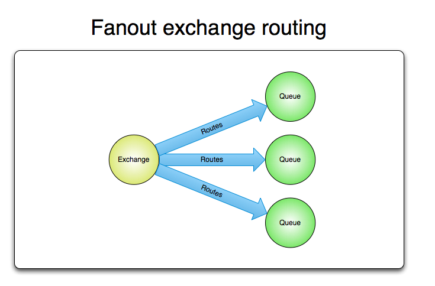

# 什么是AMQP 0-9-1

AMQP 0-9-1（高级消息队列协议）是一种消息传递协议，使客户端应用程序能够与消息中间件代理进行通信。

# 代理Brokers

消息代理接受来自发布者（发布消息的应用程序，也叫生产者）的消息并把它们路由到消费者（处理消息的应用程序）。

因为它是一个网络协议，所以发布者、消费者和代理都能部署在不同机器上。

# AMQP 0-9-1模型简介

AMQP 0-9-1模型如下：消息被发布到交换机（就像邮政局或邮箱）中，然后使用称为绑定（bindings）的规则分发消息副本到队列（queues）。然后，代理将消息传递给订阅队列的消费者，或者消费者按需从队列中获取消息。

发布消息时，发布者可以定义各种消息属性（消息元数据）。其中一些元数据可以被代理使用，但是它的其余部分对代理完全不透明，并且仅被接收消息的应用程序使用。

网络是不可靠的，并且应用程序可能无法处理消息，因此AMQP 0-9-1模型具有*消息确认*（*message acknowledgements*）的概念：当消息被传递给消费者时，消费者会自动通知代理（如果应用程序开发人员选择这样做）。当使用消息确认机制时，在收到该消息（或消息组）的通知时，代理才会完全从队列中删除该消息。

在某些情况下，例如，当无法路由消息时，可以将消息返回给发布者、丢弃，或者，如果代理实现了扩展，则将这些消息推到所谓的“死信队列（dead letter queue）”中。发布者通过使用某些参数发布消息来选择如何处理这样的情况。

队列（Queues），交换（exchanges）和绑定（bindings）称为AMQP实体。

# AMQP 0-9-1是可编程协议

AMQP 0-9-1是一种可编程协议，即AMQP 0-9-1实体和路由规则主要由应用程序本身定义，而不是代理管理员。

因此，为协议操作定义了一系列规则如声明队列和交换机、定义他们之间的绑定、订阅队列等。

这给了应用程序开发人员很多自由，但也需要他们意识到潜在的定义冲突。在实践中，定义冲突是罕见的，并且通常表明存在错误配置。

应用程序声明所需的AMQP 0-9-1实体，定义必要的路由规则，并且可以在不再使用它们时删除AMQP 0-9-1实体。

# 交换机和交换类型

消息会发送到交换机，交换机是AMQP 0-9-1实体。交换传递消息，将其路由到零或多个队列中。使用的路由算法取决于交换类型和被称为绑定的规则。AMQP 0-9-1代理提供四种交换类型：

| Exchange type             | Default pre-declared names              |
| :------------------------ | :-------------------------------------- |
| Direct exchange直连交换机 | (Empty string) and amq.direct           |
| Fanout exchange扇形交换机 | amq.fanout                              |
| Topic exchange主题交换机  | amq.topic                               |
| Headers exchange头交换机  | amq.match (and amq.headers in RabbitMQ) |

除了交换类型之外，交换机还声明了许多属性，最重要的是：

- Name：交换机名称
- Durability (exchanges survive broker restart)：是否持久化。如果持久性，则代理重启后，交换机还存在
- Auto-delete (exchange is deleted when last queue is unbound from it)：当所有与之绑定的消息队列都完成了对此交换机的使用后，删掉它
- Arguments (optional, used by plugins and broker-specific features)：可选，插件和代理特定功能使用

交换机可以是持久化的或临时的。持久化的交换机在代理重新启动任然存在，而临时的不会（当代理重新在线时，他们必须被重新声明）。并非所有场景都需要持久化的交换机。

# 默认交换机

默认交换机是代理预先声明的没有名称（空字符串）的直连交换机。它有一个特殊的属性，非常适用于简单的应用程序：创建的每个队列都是用与队列名称相同的路由key自动绑定到该类交换机。

例如，当声明一个名为为“search-indexing-online”的队列时，AMQP 0-9-1代理将使用“search-indexing-online”作为路由key将其绑定到默认交换机（在此上下文有时称为绑定key）。因此，发布到默认交换机的路由key为“search-indexing-online”的消息将被路由到队列“search-indexing-online”。换句话说，默认交换使其似乎可以直接向队列传递消息。

# 直连交换机

直连交换机基于消息路由key将消息传递到队列。直连交换机非常适合消息的单播路由（尽管它们也可用于组播路由）。下面是它的工作原理：

- 队列通过路由key K绑定到交换机
- 当具有路由key R的新消息到达直接交换机时，如果K = R，则交换机将其路由到该队列

直接交换机通常用于以循环方式在多个工作实例（相同应用程序的实例）之间分配任务。这样做时，重要的是要理解，在AMQP 0-9-1中，消息是在消费者之间负载均衡，而不是在队列之间负载均衡。

直接交换机可以以图形方式表示如下：

# 扇形交换机

扇形交换机不管绑定的key是什么，会路由消息到绑定到它的所有队列。如果N个队列绑定到扇形交换机，则当新消息发布到该交换机时，它将传递消息的副本到这N个队列。扇形交换机适合广播路由。

因为扇形交换机将消息的副本传递给绑定到它的每个队列，所以它的使用场景非常相似：

- 大型多人在线（MMO）游戏可以将其用于排行榜更新或其他全局事件
- 体育新闻网站可以使用扇形交换机实时地发布更新的分数到移动客户端
- 分布式系统可以广播各种状态和配置更新
- 群组聊天可以使用扇形交换机分发参与者之间的消息（虽然AMQP没有内置的相关概念，所以XMPP可能是一个更好的选择）

扇形交换机可以以图形方式表示如下：

# 主题交换机

主题交换机基于消息路由key和用于将队列绑定到交换机的模式之间的匹配，将消息路由到一个或多个队列。主题交换机通常用于实现各种发布/订阅模式变体。主题交换机通常用于消息的组播路由。

主题交换机具有非常广泛的使用场景。当一个问题涉及多个消费者/应用程序有选择性地接收哪种类型的消息时，应考虑使用主题交换机。

使用案例：

- 分发与特定地理位置相关的数据，例如销售点

- 由多个工作实例处理的后台任务，每个工作实例都能够处理特定的任务集
- 库存价格更新（以及其他类型的财务数据更新）
- 涉及分类或标记的新闻更新（例如，仅适用于特定运动或团队）
- 不同类型云服务的编排
- 分布式架构/操作系统的软件构建或打包，其中每个构建器只能处理一个架构或操作系统

# 头交换机

头交换机被设计用于路由多个属性，这些属性更容易用消息头表示而不是路由key。头交换机会忽略路由key属性。相反，用于路由的属性是从头属性中取得的。如果头属性值等于绑定指定的值，则匹配该消息。

可以使用多个消息头绑定消息到头交换机。在这种情况下，代理需要应用程序开发者提供更多信息，即，是匹配其中一个消息头还是所有消息头？这就是“x-match”绑定参数做的事。当“x-match”参数被设置为“any”时，匹配任意一个消息头值就行了。或者，将“x-match”设置为“all”要求所有值必须匹配。

头交换机可以看做是特殊的直连交换机。因为它们都是基于消息头属性值路由，路由key不必是字符串时，它们可以用作直接交换，例如，它可以是整数或哈希（字典）。

注意，以字符串x-开头的消息头将不会用于匹配。

# 队列

AMQP 0-9-1模型中的队列与其他消息和任务队列系统中的队列非常相似：它们存储由应用程序消费的消息。队列与交换机共享一些属性，但也有一些额外的属性：

- Name：名称
- Durable：队列在代理重启时扔存在
- Exclusive：仅被一个连接使用并且该连接关闭时队列将被删除
- Auto-delete：当最后一个消费者取消订阅时，至少有一个消费者的队列将被删除
- Arguments ：可选，由Plugins和Broker特定功能使用，例如消息TTL，队列长度限制等

在使用队列之前，必须声明它。声明队列将导致它会在尚未存在的情况下创建。如果已存在队列，并且其属性与声明中的属性相同，则该声明不会有什么影响。当已存在的队列属性和声明的不同时，将会引发一个406错误码（PRECONDITION_FAILED）的管道级异常

# 队列名

应用程序可以自己选择队列名称或让代理生成。队列名称最长为255个字节的UTF-8字符。AMQP 0-9-1代理可以生成唯一的代表应用的队列名称。要使用此功能，请将队列名称参数设为空字符串。生成的名称将以队列声明响应返回给客户端。

以“amq.”开头的队列名称只在代理内部使用。尝试使用违反此规则的名称声明队列将导致具有403返回码（ACCESS_REFUSED）的管道级别异常。

# 队列持久化

在AMQP 0-9-1中，队列可以被声明为持久化的或暂存的。持久化的队列的元数据存储在磁盘上，而临时队列的元数据在可用的情况下存储在内存中。

在需要持久化的场景下，应用程序必须使用持久化的队列来确保发布者将推送的消息标记为持久化。

# 绑定

绑定是交换机将消息传送到队列使用的规则（以及其他内容）。为了让交换机E将消息路由到队列Q，Q必须绑定到E。一些类型的交换机使用的绑定有可选的路由key属性。路由key的目的是选择正确的发布到交换机的某些消息到绑定队列。换句话说，路由key就像是一个过滤器。

打个比方：

- 队列就像目的地长沙市
- 交换机就像宝安机场
- 绑定就是从宝安机场到长沙的路径，有多条路径可以选择

这样的间接层让那种很难用直接推送到队列的方式实现的的路由场景变得可能，并且也减少了开发者的重复性工作。

如果消息不能路由到队列（比如因为交换机没有绑定任何队列），消息将被丢弃或返回给发布者，具体是哪种取决于发布者设置的消息的相关属性。

# 消费者

除非应用程序可以消费它们，否则存储队列中的消息是没用的。在AMQP 0-9-1模型中，应用程序有两种方法来执行此操作：

- 订阅传递给它们的消息（“push API”）：这是推荐的选项
- 轮询（“pull API”）：这种方式很低效，在大多数情况下应该避免

使用“push API”，应用程序必须指定消费哪个队列的消息。当他们这样做时，我们说他们注册了消费者或简单地说，订阅了一个队列。每个队列可以拥有多个消费者或注册独占消费者（在消费时从队列中排除所有其他消费者）。

每个消费者（订阅）有一个称为消费者标记的标识符。它可用于取消订阅消息。消费者标签是字符串。

# 消息确认

消费者应用程序 - 也就是说，接收和处理消息的应用程序 - 可能偶尔可能会无法处理单个消息，也可能程序崩溃了。还有可能出现网络问题。这提出了一个问题：代理应该什么时候从队列中删除消息？AMQP 0-9-1规范为消费者提供了消息确认机制。有两种确认模式：

- 在代理向应用程序发送一个消息之后（使用basic.deliver或者basic.get-ok方法）
- 在应用程序发送确认消息后（使用basic.ack方法）

前者称为自动确认模型，而后者称为显式确认模型。通过显式模型，应用程序选择在何时发送确认消息。它可以在收到消息后，或在处理前存到数据存储器之后，或者在完全处理消息之后（例如，成功地获取网页，处理和将其存储到一些持久数据存储中）。

如果消费者死亡而不发送确认，则代理将将其重新发送到另一个消费者，或者如果没有可用消费者，则代理将在至少一个消费者重新注册到同一个队列后尝试重新发送消息。

由于网络不可靠，或者应用程序无法响应，通常需要具有某种机制来处理确认。有时只需确认消费者已收到消息。有时，确认意味着由消费者验证并处理了消息，例如，验证具有强制性数据并持久地持续到数据存储或索引中。

这种情况非常常见，因此AMQP 0-9-1具有名为消息确认（有时称为*acks*）的内置功能，消费者用于确认消息传递或处理。如果应用程序崩溃（AMQP Broker在连接时关闭时会注意到），如果预期消息确认但是AMQP代理未收到ack，则该消息将重入队列（并且可能立即将其发送给另一个存在的消费者）。

具有内置协议的确认有助于开发人员构建更强大的软件。

# 拒绝消息

当消费者应用程序接收到消息时，可能无法成功处理该消息。应用程序可以通过拒绝消息来告知代理消息处理失败流（或者无法在当前完成）。拒绝消息时，应用程序可以要求代理丢弃或重新入队列。当队列中只有一个消费者时，请确保通过拒绝消息并重入队列不会创建无穷的消息循环发送。

# 否定应答

可以使用basic.reject方法拒绝消息，但basic.reject有一个限制：没有办法拒绝多个消息。但是如果您使用的是RabbitMQ，那么就有一个解决方案。RabbitMQ提供称为否定应答（*negative acknowledgements*）或*nacks*的AMQP 0-9-1扩展。

# 预取消息

对于多个消费者共享队列的情况，能够指定在发送下一个确认之前可以一次发送到每个消费者的消息数是有用的。这可以用作简单的负载平衡技术或提高吞吐量，如果消息倾向于批量发布。例如，如果生产应用程序因工作需要每分钟发送消息。

请注意，RabbitMQ仅支持信道级预取计数，而不是基于连接或大小的预取。

# 消息属性和负载

AMQP 0-9-1模型中的消息具有属性。某些属性很常见，即AMQP 0-9-1规范定义它们，应用程序开发人员不必考虑确切的属性名称。一些例子是

- Content type
- Content encoding
- Routing key
- Delivery mode (persistent or not)
- Message priority
- Message publishing timestamp
- Expiration period
- Publisher application id

AMQP代理会使用其中某些属性，但大多数还是对应用程序开放的。某些属性是可选的，称为headers。它们类似于HTTP中的X-Headers。发布消息时，会设置消息属性。

消息还具有有效载荷（它们携带的数据），AMQP代理将其视为不透明字节数组。代理不会检查或修改有效负载。消息可以仅包含属性而没有有效载荷。通常使用JSON，Thrift，Protocol Buffers和MessagePack等序列化格式来序列化结构化数据，以便将其发布为消息有效载荷。协议对等体通常使用“content-type”和“content-encoding”字段来传达此信息，但这仅是约定。

消息可能会发布为持久化的，这使得代理将它们持久化到磁盘。如果重新启动服务器，系统可确保收到的持久消息不会丢失。只将消息发布到持久化的交换机或所路由的持久化的队列不会使消息持久化：这一切都取决于消息本身的持久化模式。发布消息并持久化会影响性能（就像数据存储一样，持久化会在性能上有一定开销）。

# AMQP 0-9-1方法

AMQP 0-9-1有许多方法。方法是操作（如http方法），并且不像面向对象编程语言中的方法。AMQP 0-9-1中的协议方法被分组为类。类只是AMQP方法的逻辑分组。[AMQP 0-9-1 手册](https://www.rabbitmq.com/amqp-0-9-1-reference.html)含所有AMQP方法的完整细节。

让我们来看看交换机类，这是一组与交换机的操作相关的方法。它包括以下操作：

- exchange.declare
- exchange.declare-ok
- exchange.delete
- exchange.delete-ok

上面的操作组成逻辑对：exchange.declare和exchange.declare-ok，exchange.delete和exchange.delete-ok。这些操作是“requests”（客户端发送）和“responses”（通过代理发送响应上述“请求”））

举个例子，客户端要求代理使用exchange.declare方法声明新的Exchange：

如上图所示，exchange.declare带有多个参数。它们使客户端可指定Exchange名称，类型，持久性标志等。

如果操作成功，则代理使用exchange.declare-ok方法响应：

exchange.declare-ok不携带除管道号之外的任何参数。

队列的queue.declare和queue.declare-ok也是类似：

并非所有AMQP 0-9-1方法都有对应方法。有些（如最广泛使用的basic.publish）没有相应的“response”方法，有些（如basic.get）具有多个可能的“response”。

# 连接

AMQP 0-9-1连接通常是长期的。AMQP 0-9-1是一种应用级别协议，它使用TCP进行可靠的消息传递。连接使用身份验证，可以使用TLS保护。当应用程序不再需要连接到服务器时，它应该优雅地关闭其AMQP 0-9-1连接，而不是突然关闭底层TCP连接。

# 管道

某些应用程序需要多个连接到代理。但是同时持有多个TCP连接不是一个好的选择，因为这样做会消耗系统资源并使配置防火墙更加困难。AMQP 0-9-1连接使用管道实现复用，可以被认为是“共享单个TCP连接的轻量级连接”。

客户端执行的每个协议操作发生在管道上。特定频道上的通信与另一个通道上的通信是完全分开的，因此每个协议方法还携带channel ID（channal number），这是代理和客户端用来弄清该方法作用管道的整数。

管道仅存在连接的上下文中，而不是自己的。当连接关闭时，所有管道也会关闭。

对于使用多个线程/进程进行处理的应用程序，每个线程/进程会打开新的管道，而不会共享管道。

# 虚拟主机

为了使单个代理能够托管多个孤立的“environments”（用户组，交换机，队列等），AMQP 0-9-1包含了虚拟主机的概念（vhosts）。它们类似于许多流行的Web服务器使用的虚拟主机，并提供完全隔离的环境，其中就有AMQP实体。协议客户端指定在连接协商期间他们想要使用的vhosts。

# 可扩展的AMQP

AMQP 0-9-1有几个扩展点：

- 自定义交换机类型让开发人员实现路由方案。
- 交换机和队列的声明可以包括代理可以使用的附加属性。例如，RabbitMQ中的 [per-queue message TTL](https://www.rabbitmq.com/ttl.html)以这种方式实现。
- 代理特定于协议的扩展。例如[extensions that RabbitMQ implements](https://www.rabbitmq.com/extensions.html)
- [New AMQP 0-9-1 method classes](https://www.rabbitmq.com/amqp-0-9-1-quickref.html#class.confirm)
- 代理可以用附加插件扩展，例如，RabbitMQ管理端和HTTP API被实现为插件。

这些功能使AMQP 0-9-1模型更加灵活。

# AMQP 0-9-1客户端生态环境

许多流行的编程语言和平台有许多AMQP 0-9-1客户端。其中一些只提供AMQP方法的实现。有些提供其他功能、便利的方法和抽象。一些客户端是异步的（非阻塞），有些是同步（阻塞），有些支持两种模式。某些客户端支持特定于供应商的扩展（例如，RabbitMQ特定的扩展）。
